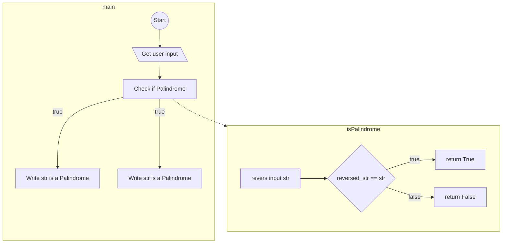

# pyflow
An experiment in compiling flowcharts() in docstrings together.

Example:
for the given file palindrome.py
```python

def isPalindrome(str):
  """
  check if string is isPalindrome

  Args:
    str (String):
  

  Returns:
    Boolean: True if the str is a Palindrome

  flowchart:
    S[revers input str] --> X{reversed_str == str}
    X -- true --> N[return True]
    X -- false --> M[return False]
  """
  str_reversed = str[::-1]
  return str == str_reversed


def main():
  """
  main of program
  
  flowchart:
    A((Start)) --> B[\Get user input\]
    B --> C[Check if Palindrome]
    C -.-> isPalindrome
    C -- true --> D[Write str is a Palindrome]
    C -- true --> E[Write str is a Palindrome]
  """
  s = input('Enter string\n')
  ans = isPalindrome(s)
  
  if ans:
    print(f"{s} is a Palindrome")
  else:
    print(f"{s} is not a Palindrome")

if __name__ == "__main__":
  main()
```

If you run `python pyflow .\palindrome.py`

The output will be:
```
flowchart TD
subgraph isPalindrome
S[revers input str] --> X{reversed_str == str}
X -- true --> N[return True]
X -- false --> M[return False]
end
subgraph main
A((Start)) --> B[\Get user input\]
B --> C[Check if Palindrome]
C -- true --> D[Write str is a Palindrome]
C -- true --> E[Write str is a Palindrome]
end
C -.-> isPalindrome
```

